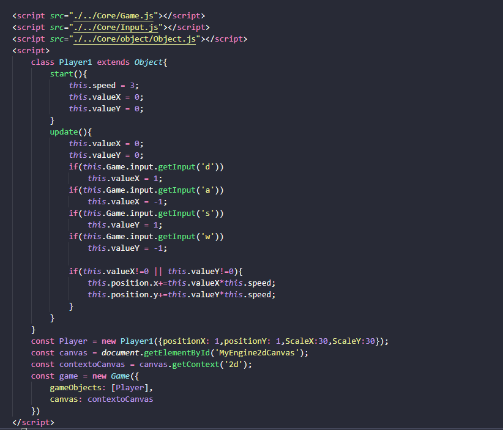

# GameEngine2DWithJavaScript

Este projeto tem um intuito de deenvolver uma GameEngine Basica e de facil criação utilizando apenas o JavaScript e os jogos feitos nela serão executados diretamente pelo navegador

O desenvolvimento teve inicio no dia 26/02/2021, minha meta naquele momento era entender até onde eu poderia chegar usando apenas JavaScript puro e oque melhor do que um game não é?

Como Usar?

<h2>Primeiro é necessario Importa os Scripts do Core da Engine presentes na pasta <strong>src/core</strong</h2>
   

Nessa pasta encontramos o sistema de Input, Game e Objects que são necessários para o desenvolvimento de um Game basico, novas funcionalidades serão adicionadas na Engine com o passar do tempo, caso deseje apenas usar a engine.

